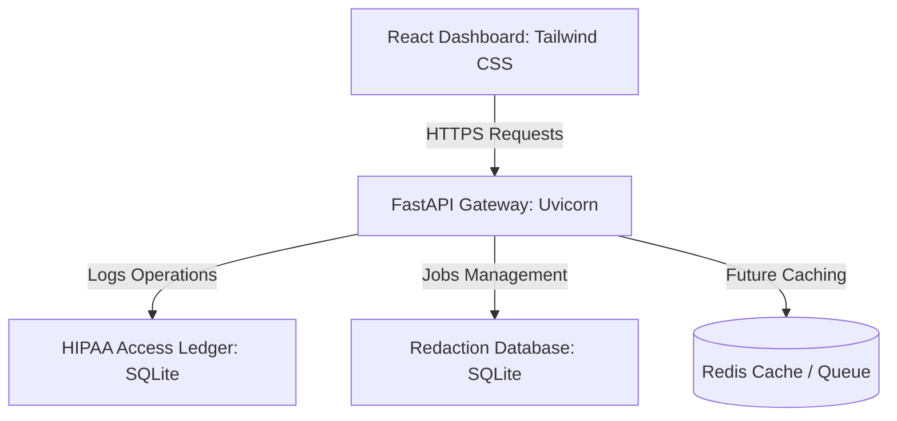

# HealthTech PHI/PII Redaction Pipeline for LLMs (Day 1 Foundation)

A production-ready, HIPAA-compliant pipeline to identify, log, and redact Protected Health Information (PHI) and Personally Identifiable Information (PII) from clinical notes before passing them to Large Language Model (LLM) APIs.

Day 1 delivers the **complete project foundation** with robust FastAPI backend services, an elegant React dashboard styled with a professional healthcare theme, structured database migrations (SQLite + ready Redis configurations), full Dockerization, and robust compliance audit logs.

---

## 🏛️ Architecture & System Design



### Key Technical highlights:
* **Structured API Gateway**: Built with FastAPI, showcasing clean layer-boundaries (schemas, routes, models, middleware, services, configuration).
* **Responsive HIPAA Access Ledger**: Every action records IP address, caller actor, status code, and target resources to comply with HIPAA security rules.
* **Modern Dashboard Interface**: High-fidelity dashboard displaying analytics, system health stats, recent pipeline logs, and customizable redaction properties.

---

## 📂 Project Structure

```text
healthcare-redaction/
├── backend/                  # FastAPI Application Core
│   ├── app/
│   │   ├── api/              # API router and modular routes (health, redaction, audit)
│   │   ├── config/           # Pydantic Settings and Logging setups
│   │   ├── database/         # SQLAlchemy engine and session creators
│   │   ├── middleware/       # Custom Request Logging & Correlation-ID injector
│   │   ├── models/           # ORM Declarations (AuditLog, RedactionJob)
│   │   ├── schemas/          # Input/Output Pydantic validations
│   │   ├── services/         # Decoupled business logic controllers
│   │   ├── utils/            # Consistent JSON response standardizers
│   │   └── main.py           # Application entry point
│   ├── tests/                # Robust unit tests (FastAPI TestClient + SQLite memory)
│   ├── Dockerfile            # Multi-stage lightweight python container
│   ├── requirements.txt      # Decoupled python dependencies list
│   └── .env.example          # Template environment setup
├── frontend/                 # React Dashboard Core
│   ├── src/
│   │   ├── components/       # Layout, Sidebar, Navbar components
│   │   ├── pages/            # Home, Upload, AuditLogs, Statistics, Settings pages
│   │   ├── services/         # Axios API connection endpoints
│   │   ├── App.jsx           # React Router mappings
│   │   ├── main.jsx          # DOM rendering entry
│   │   └── index.css         # Tailwind & Scrollbar bindings
│   ├── index.html            # Primary html mount
│   ├── package.json          # Node dependencies
│   ├── tailwind.config.js    # Customized healthcare color theme configurations
│   ├── postcss.config.js     # PostCSS configurations
│   ├── vite.config.js        # Vite configurations + API proxy setup
│   └── Dockerfile            # Multi-stage Node builder serving through Nginx
├── docker-compose.yml        # Service orchestrator (Backend, Frontend, Redis)
├── .gitignore                # Complete files/folders ignore ledger
└── README.md                 # Project handbook
```

---

## 🚀 Running Locally

### Prerequisites
* **Python 3.11+** installed
* **Node.js 20+** installed
* **Docker & Docker Compose** (Optional, for containerized run)

---

### Method 1: Local Standard Installation

#### 1. Backend Setup
1. Open a terminal and navigate to the backend directory:
   ```bash
   cd backend
   ```
2. Create and activate a virtual environment:
   ```bash
   python -m venv venv
   # On Windows:
   .\venv\Scripts\activate
   # On macOS/Linux:
   source venv/bin/activate
   ```
3. Install dependencies:
   ```bash
   pip install -r requirements.txt
   ```
4. Copy the environment template and start the service:
   ```bash
   copy .env.example .env
   uvicorn app.main:app --reload
   ```
   * The backend API will start at [http://localhost:8000](http://localhost:8000).
   * Interactive OpenAPI Docs will be available at [http://localhost:8000/docs](http://localhost:8000/docs).
   * Verify the Health endpoint: [http://localhost:8000/api/v1/app/health](http://localhost:8000/api/v1/app/health).

#### 2. Frontend Setup
1. Open a new terminal and navigate to the frontend directory:
   ```bash
   cd frontend
   ```
2. Install package dependencies:
   ```bash
   npm install
   ```
3. Start the Vite development server:
   ```bash
   npm run dev
   ```
   * Open [http://localhost:5173](http://localhost:5173) in your browser to explore the dashboard.

---

### Method 2: Containerized Deployment (Docker)

To launch the complete environment (FastAPI Backend, React Dashboard, and Redis Cache) inside isolated containers:

1. Make sure you are in the root directory (`healthcare-redaction/`).
2. Build and launch all services:
   ```bash
   docker-compose up --build
   ```
3. Open your browser and view:
   * **React Dashboard**: [http://localhost](http://localhost) (Port 80)
   * **FastAPI Docs**: [http://localhost:8000/docs](http://localhost:8000/docs)

---

## 🛡️ Verification & Testing

Verify that all endpoints pass our high-standard test cases:

1. Navigate to the backend folder:
   ```bash
   cd backend
   ```
2. Execute the test suite using pytest:
   ```bash
   pytest -v
   ```

---

## 🔮 Future Roadmap (Day 2 & Day 3)

* **Day 2 (PHI Detection & Redaction)**:
  * Wire **Microsoft Presidio** Analyzer & Anonymizer to redact 18 Safe Harbor identifiers.
  * Integrate custom **SpaCy** medical entities model for precision clinical parsing.
  * Implement dynamic manual review screens allowing doctors to toggle redactions on/off.
* **Day 3 (LLM Integrations & AI Audit)**:
  * Connect **OpenAI** GPT-4 and local **Ollama** LLMs for final structural safety checks.
  * Implement streaming redacted notes directly into agentic workflows.
