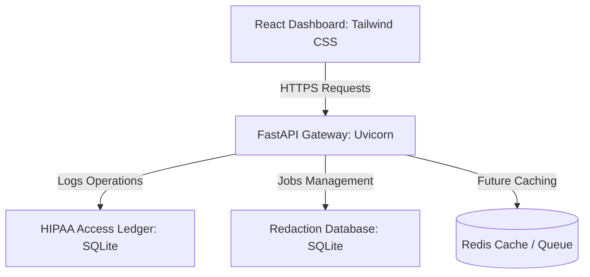

# HealthTech PHI/PII Redaction Pipeline for LLMs (Day 1 Foundation)

A production-ready, HIPAA-compliant pipeline to identify, log, and redact Protected Health Information (PHI) and Personally Identifiable Information (PII) from clinical notes before passing them to Large Language Model (LLM) APIs.

Day 1 delivers the **complete project foundation** with robust FastAPI backend services, an elegant React dashboard styled with a professional healthcare theme, structured database migrations (SQLite + ready Redis configurations), full Dockerization, and robust compliance audit logs.

---

## 🏛️ Architecture & System Design



### Key Technical highlights:
* **Structured API Gateway**: Built with FastAPI, showcasing clean layer-boundaries (schemas, routes, models, middleware, services, configuration).
* **Responsive HIPAA Access Ledger**: Every action records IP address, caller actor, status code, and target resources to comply with HIPAA security rules.
* **Modern Dashboard Interface**: High-fidelity dashboard displaying analytics, system health stats, recent pipeline logs, and customizable redaction properties.

---

## 📂 Project Structure

```text
healthcare-redaction/
├── backend/                  # FastAPI Application Core
│   ├── app/
│   │   ├── api/              # API router and modular routes (health, redaction, audit)
│   │   ├── config/           # Pydantic Settings and Logging setups
│   │   ├── database/         # SQLAlchemy engine and session creators
│   │   ├── middleware/       # Custom Request Logging & Correlation-ID injector
│   │   ├── models/           # ORM Declarations (AuditLog, RedactionJob)
│   │   ├── schemas/          # Input/Output Pydantic validations
│   │   ├── services/         # Decoupled business logic controllers
│   │   ├── utils/            # Consistent JSON response standardizers
│   │   └── main.py           # Application entry point
│   ├── tests/                # Robust unit tests (FastAPI TestClient + SQLite memory)
│   ├── Dockerfile            # Multi-stage lightweight python container
│   ├── requirements.txt      # Decoupled python dependencies list
│   └── .env.example          # Template environment setup
├── frontend/                 # React Dashboard Core
│   ├── src/
│   │   ├── components/       # Layout, Sidebar, Navbar components
│   │   ├── pages/            # Home, Upload, AuditLogs, Statistics, Settings pages
│   │   ├── services/         # Axios API connection endpoints
│   │   ├── App.jsx           # React Router mappings
│   │   ├── main.jsx          # DOM rendering entry
│   │   └── index.css         # Tailwind & Scrollbar bindings
│   ├── index.html            # Primary html mount
│   ├── package.json          # Node dependencies
│   ├── tailwind.config.js    # Customized healthcare color theme configurations
│   ├── postcss.config.js     # PostCSS configurations
│   ├── vite.config.js        # Vite configurations + API proxy setup
│   └── Dockerfile            # Multi-stage Node builder serving through Nginx
├── docker-compose.yml        # Service orchestrator (Backend, Frontend, Redis)
├── .gitignore                # Complete files/folders ignore ledger
└── README.md                 # Project handbook
```

---

## 🚀 Running Locally

### Prerequisites
* **Python 3.11+** installed
* **Node.js 20+** installed
* **Docker & Docker Compose** (Optional, for containerized run)

---

### Method 1: Local Standard Installation

#### 1. Backend Setup
1. Open a terminal and navigate to the backend directory:
   ```bash
   cd backend
   ```
2. Create and activate a virtual environment:
   ```bash
   python -m venv venv
   # On Windows:
   .\venv\Scripts\activate
   # On macOS/Linux:
   source venv/bin/activate
   ```
3. Install dependencies:
   ```bash
   pip install -r requirements.txt
   ```
4. Copy the environment template and start the service:
   ```bash
   copy .env.example .env
   uvicorn app.main:app --reload
   ```
   * The backend API will start at [http://localhost:8000](http://localhost:8000).
   * Interactive OpenAPI Docs will be available at [http://localhost:8000/docs](http://localhost:8000/docs).
   * Verify the Health endpoint: [http://localhost:8000/api/v1/app/health](http://localhost:8000/api/v1/app/health).

#### 2. Frontend Setup
1. Open a new terminal and navigate to the frontend directory:
   ```bash
   cd frontend
   ```
2. Install package dependencies:
   ```bash
   npm install
   ```
3. Start the Vite development server:
   ```bash
   npm run dev
   ```
   * Open [http://localhost:5173](http://localhost:5173) in your browser to explore the dashboard.

---

### Method 2: Containerized Deployment (Docker)

To launch the complete environment (FastAPI Backend, React Dashboard, and Redis Cache) inside isolated containers:

1. Make sure you are in the root directory (`healthcare-redaction/`).
2. Build and launch all services:
   ```bash
   docker-compose up --build
   ```
3. Open your browser and view:
   * **React Dashboard**: [http://localhost](http://localhost) (Port 80)
   * **FastAPI Docs**: [http://localhost:8000/docs](http://localhost:8000/docs)

---

## 📁 Day 2 Ingestion System — Folder Explanation

The following components were added to implement the secure note ingestion pipeline:
* **`backend/app/database/models.py`**: SQLite ORM model for the `uploads` table, tracking metadata, types (`TEXT`, `TXT`, `PDF`), payload sizes in bytes, and status.
* **`backend/app/services/upload_service.py`**: Business logic layer managing input validation, file storage on disk in `uploads/`, filename sanitization, and strict directory traversal prevention.
* **`backend/app/api/upload.py`**: FastAPI router exposing the endpoints for uploading text, files, listing, detail retrieval, and deletion.
* **`frontend/src/services/uploadService.js`**: Axios API service layer driving raw text and multipart/form-data file uploads (complete with upload progress tracking).
* **`frontend/src/components/UploadCard.jsx`**: Dashboard KPI stats cards computing total uploads, uploads today, pending queue, and average upload size.
* **`frontend/src/components/UploadForm.jsx`**: Premium drag-and-drop ingestion form with file validations, text editors, character counters, progress bars, and status banners.
* **`frontend/src/components/UploadHistory.jsx`**: Administrative list table containing upload metadata, status pills, secure two-step delete confirmations, and clinical text preview modals.
* **`frontend/src/pages/ClinicalUpload.jsx`**: Ingestion management hub orchestrating forms, history, and real-time dashboard calculations.

---

## 🔌 API Documentation

All ingestion endpoints live under the `/api` prefix:

### 1. Upload Raw Clinical Text
* **Endpoint**: `POST /api/upload-text`
* **Request Body**:
  ```json
  {
    "note": "Patient Alice Brown, DOB 05/14/1992, visited reporting acute abdomen..."
  }
  ```
* **Response (201 Created)**:
  ```json
  {
    "success": true,
    "message": "Clinical note uploaded successfully",
    "note_id": "8a8fca02-e221-49fa-b394-399a9a3b68ee"
  }
  ```
* **Validation**: Rejects empty notes, and notes exceeding 100,000 characters.

### 2. Upload Document File (TXT or PDF)
* **Endpoint**: `POST /api/upload-file`
* **Request Format**: `multipart/form-data` with `file` field
* **Response (201 Created)**:
  ```json
  {
    "id": "e2fcfbc2-3c2b-4221-a20b-bd989f5e27fb",
    "filename": "patient_chart.pdf",
    "uploaded_at": "2026-06-26T12:00:00.000Z",
    "file_type": "PDF",
    "size_bytes": 14205,
    "status": "Uploaded"
  }
  ```
* **Validation**: Max file size is 10MB. Rejects file types other than `.txt` and `.pdf`.

### 3. List All Uploads
* **Endpoint**: `GET /api/uploads`
* **Response (200 OK)**:
  ```json
  [
    {
      "id": "e2fcfbc2-3c2b-4221-a20b-bd989f5e27fb",
      "filename": "patient_chart.pdf",
      "uploaded_at": "2026-06-26T12:00:00.000Z",
      "file_type": "PDF",
      "size_bytes": 14205,
      "status": "Uploaded"
    }
  ]
  ```

### 4. Get Upload Details
* **Endpoint**: `GET /api/uploads/{id}`
* **Response (200 OK)**:
  ```json
  {
    "id": "8a8fca02-e221-49fa-b394-399a9a3b68ee",
    "filename": "Direct Note Upload",
    "note_text": "Patient Alice Brown, DOB 05/14/1992...",
    "file_type": "TEXT",
    "size_bytes": 88,
    "created_at": "2026-06-26T12:05:00.000Z",
    "status": "Uploaded"
  }
  ```

### 5. Delete Upload
* **Endpoint**: `DELETE /api/uploads/{id}`
* **Response (200 OK)**:
  ```json
  {
    "success": true,
    "message": "Clinical note with ID '{id}' deleted successfully."
  }
  ```
* **Behavior**: Deletes the database metadata record and removes the file from local server disk storage.

---

## 🛡️ Security Safeguards
* **CORS Protection**: Access control headers enabled to allow seamless, secure communication with authorized client domains.
* **Directory Traversal Protection**: Filenames are strictly resolved relative to the target upload directory. Any attempt to reference external paths (e.g. `../../` paths) is immediately detected and rejected with a `400 Bad Request` before file operations run.
* **Filename Sanitization**: Uploaded filenames are stripped of non-alphanumeric/dot/dash/underscore characters to prevent shell injections and local file system issues.
* **UUID Isolation**: Database records are indexed by cryptographically random UUIDv4 identifiers, preventing ID harvesting or direct object reference leakage.

---

## 🔮 Future Roadmap

* **Day 3 (Regex & Presidio PHI Detection)**:
  * Implement custom regular expression filters for rapid PHI scrubbing.
  * Integration of **Microsoft Presidio** Analyzer & Anonymizer for deep NLP-driven PHI/PII classification (18 Safe Harbor identifiers).
  * Manual review screen allowing healthcare operators to audit, confirm, and export redacted texts.
* **Day 4 (LLM Integrations & Safelands)**:
  * Streaming redacted clinical transcriptions into OpenAI, local Ollama, and Anthropic APIs.
  * Audited LLM output evaluation.
